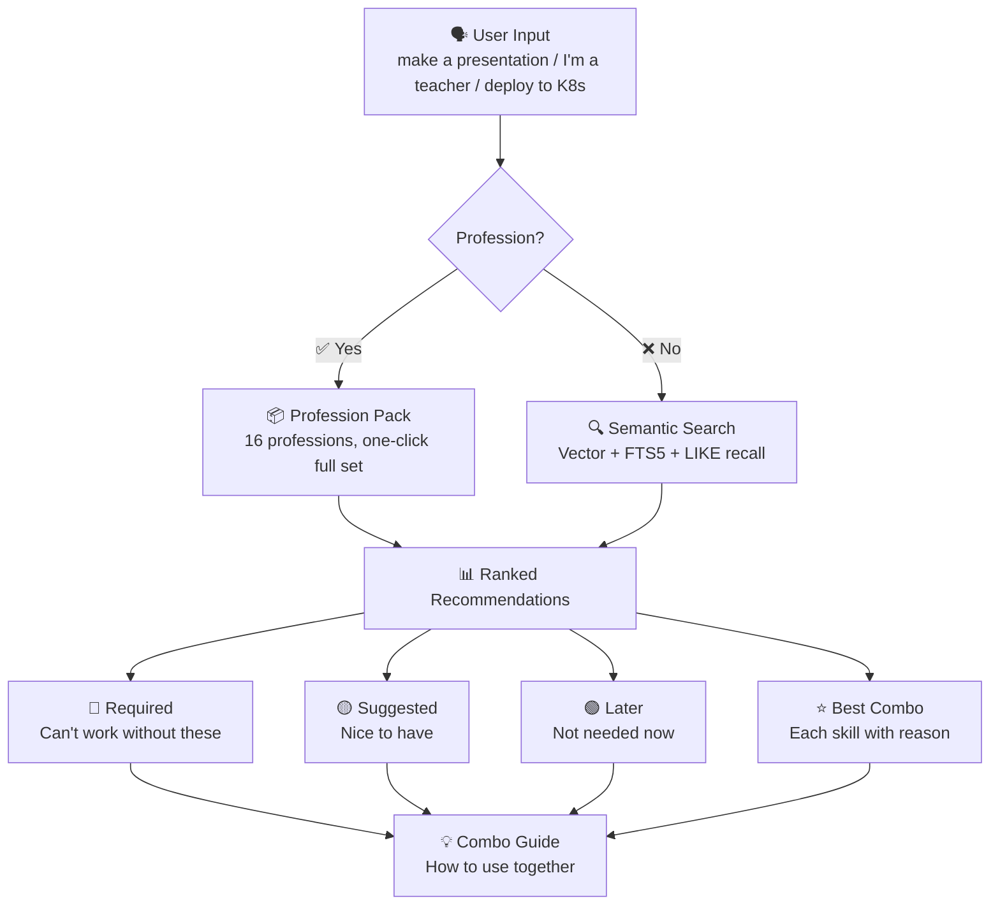

# skill-advisor 🧭

> 🎯 Tell AI who you are or what you want to do — it recommends exactly the skills you need

[](LICENSE)
[](https://www.python.org/)
[](data/skill-advisor.db)
[](https://github.com/sufakfn/skill-advisor/actions)

[English](README.en.md) | [中文](README.md)

---

## In One Sentence

- 🎯 "What should I use for PPT?" → Instantly recommends PPT creation + design + charting tools
- 🎬 "I want to make viral TikTok videos" → Recommends full pipeline: script → voiceover → subtitles → distribution
- 🚀 "Deploy to K8s" → Recommends Docker + K8s + monitoring + logging stack
- 💰 "Make a money-making blog" → Recommends full workflow: build + SEO + content + monetization
- 🤖 "Build an AI customer service" → Recommends full stack: LLM + knowledge base + UI + monitoring
- 👨‍🏫 "I'm a teacher" → Recommends grading + coursework + grading analysis + parent communication

---

## 😤 Sound Familiar?

❌ Spent 30 minutes on GitHub looking for a "PPT" skill, found nothing useful
❌ Installed 50 AI skills, only use 5, the rest collect dust
❌ Don't know what to install for a "React project", searched all day
❌ Asked AI "recommend some skills", got a bunch of outdated links
❌ Want to make short videos, need 4 different apps for editing/voiceover/subtitles/covers

## ✅ skill-advisor Changes Everything:

🎯 Say "make a presentation" → Instantly recommends PPT skills (not keyword matching! semantic understanding)
🎯 Say "I'm a video creator" → Recommends full toolkit from scripting to multi-platform distribution
🎯 Say "deploy to K8s" → Recommends Docker/K8s/monitoring/logging stack
🎯 Say "money-making blog" → Recommends full workflow: build + SEO + content + monetization
🎯 Say "AI customer service" → Recommends full stack: LLM + knowledge base + UI + monitoring

💡 Not keyword search — it truly "understands" you
💡 Every recommendation comes with a reason
💡 Best combinations tell you "why these work together"

---

## 🎬 30 Seconds to Get Started

### Demo 1: Vague Need → Semantic Match (Not Keywords!)

Input: `skill-advisor search "I want to make a money-making blog"`

```
🔍 "I want to make a money-making blog" — 10 results (45ms)

#### 🔴 Required (Blog Core)

| Installed | Skill | What It Does |
|:---:|------|----------|
| ⬜ | next-blog | Build modern blog with Next.js |
| ⬜ | seo-optimization | Get search engines to index your blog |
| ⬜ | content-research-writer | AI-assisted high-quality article writing |

#### 🟡 Suggested (Make More Money)

| Installed | Skill | What It Does |
|:---:|------|----------|
| ⬜ | google-analytics | Track visitor sources and behavior |
| ⬜ | newsletter-subscribe | Collect emails, build private audience |
| ⬜ | affiliate-link | Auto-insert affiliate links to earn |

#### 🟢 Later (When Traffic Grows)

| Installed | Skill | When to Use |
|:---:|------|-----------|
| ⬜ | ad-revenue | When monthly visitors exceed 10K |
| ⬜ | membership-gate | When you have loyal readers |

#### ⭐ Best Combination — Covers: Building, SEO, Content, Monetization

💡 Why this combination?
next-blog builds the blog → seo-optimization gets search traffic → content-research-writer produces content → newsletter-subscribe builds audience → affiliate-link starts monetization. 5 steps to a money-making blog.

| Installed | Skill | Reason |
|:---:|------|----------|
| ⬜ | next-blog | Core: Modern blog framework |
| ⬜ | seo-optimization | Traffic: Search engine indexing |
| ⬜ | content-research-writer | Content: AI-assisted writing |
| ⬜ | affiliate-link | Monetization: Affiliate marketing |
```

---

### Demo 2: Profession → Full Toolkit + Combo Guide

Input: `skill-advisor search "I'm a short video creator, want to make viral TikTok videos"`

```
🔍 "I'm a short video creator" — 1 result (12ms)

### 📦 🎬 Content Creator Pack

Audience: Short video creators, content operators, media entrepreneurs
Description: Full AI assistant from topic selection to publishing — script writing, video generation, voiceover, subtitles, multi-platform distribution

| Status | Skill | Role | Description |
|:---:|------|------|------|
| ✅ | content-research-writer | 🔴Required | Core: AI-assisted viral script writing |
| ⬜ | video-creation-suite | 🔴Required | One-click short video generation with templates |
| ⬜ | tts-voice-synthesis | 🔴Required | Text-to-speech, multiple voice options |
| ⬜ | subtitle-generator | 🟡Suggested | Auto-generate subtitles from speech |
| ⬜ | thumbnail-maker | 🟡Suggested | One-click eye-catching cover creation |
| ⬜ | multi-platform-publish | 🟡Suggested | One-click distribution to TikTok/Bilibili/YouTube |

Combo Guide:
> Use content-research-writer for scripts → video-creation-suite for videos → tts-voice-synthesis for voiceover → subtitle-generator for subtitles → thumbnail-maker for covers → multi-platform-publish for distribution.
> Used to take 3 days per video, now 30 minutes.
```

---

### Demo 3: Full Project → DevOps Recommendation

Input: `skill-advisor search "Help me build an AI customer service system"`

```
🔍 "Help me build an AI customer service system" — 10 results (38ms)

#### 🔴 Required (Project Core)

| Installed | Skill | What It Does |
|:---:|------|----------|
| ⬜ | llm-agent | Connect to GPT/Claude and other LLMs |
| ⬜ | knowledge-base | Build enterprise knowledge base for accurate AI answers |
| ⬜ | chat-ui | User interaction interface |

#### 🟡 Suggested (Improve Quality)

| Installed | Skill | What It Does |
|:---:|------|----------|
| ⬜ | webapp-testing | E2E testing for system stability |
| ⬜ | sentry-sdk-setup | Real-time error tracking |
| ⬜ | rate-limiter | Prevent API abuse |

#### 🟢 Later (When User Base Grows)

| Installed | Skill | When to Use |
|:---:|------|-----------|
| ⬜ | multi-tenant | When serving multiple clients |
| ⬜ | analytics-dashboard | When you need user behavior analysis |

#### ⭐ Best Combination — Covers: AI, Knowledge Base, UI, Monitoring

💡 Why this combination?
llm-agent connects to LLMs → knowledge-base ensures accurate answers → chat-ui provides interface → sentry-sdk-setup monitors issues → vercel-deploy one-click launch. Covers full DevOps workflow: AI → Data → Frontend → Ops.

| Installed | Skill | Reason |
|:---:|------|----------|
| ⬜ | llm-agent | Core: LLM integration |
| ⬜ | knowledge-base | Accuracy: Enterprise knowledge base |
| ⬜ | chat-ui | Interaction: User interface |
| ⬜ | sentry-sdk-setup | Stability: Online monitoring |
```

---

## ✨ Why skill-advisor?

### 🔍 Semantic Search — Not Keywords, Truly "Understands" You
- "make a presentation" → matches PPT skills (not keyword matching!)
- "money-making blog" → recommends build + SEO + content + monetization
- "deploy to K8s" → recommends Docker + K8s + monitoring + logging
- Powered by BAAI Chinese vector model, bilingual support

### 📦 Profession Packs — 16 Scenarios, One-Click Full Recommendations
- 👨‍🏫 Teacher → grading + coursework + grade analysis + parent communication
- 🎬 Content Creator → scripting + voiceover + subtitles + multi-platform
- 👔 PM → PRD + competitive analysis + user research + roadmap
- 🎨 Designer → UI/UX + visual design + prototyping + review
- 💼 HR → recruitment + payroll + attendance + contracts
- 💰 Finance → reporting + modeling + audit + tax
- 📈 Sales → CRM + performance tracking + presentations
- ⚖️ Lawyer → contract review + documents + case search
- 🏥 Doctor → research + patient records + data analysis
- 📚 Student → papers + notes + presentations + exam prep
- 📊 Investor → stock analysis + financial modeling + research
- 🛒 E-commerce → copywriting + marketing + order management
- 🖥️ Frontend → React/Vue + testing + performance + deployment
- ⚙️ Backend → database + security + API + ops
- ✍️ Writer → research + writing + formatting + publishing
- 🎯 Job Seeker → resume + interview + portfolio + research

### 🌐 17,700+ Skills — Covering Everything
- Dev: Frontend/Backend/Mobile/DevOps/AI/Data
- Design: UI/UX/Visual/Prototype/3D/Animation
- Writing: Copy/Papers/Novels/Scripts/Translation
- Business: Marketing/Sales/Finance/Operations/Management
- Daily: Study/Life/Entertainment/Health

### ⚡ < 50ms Response — Local Database, Offline Ready
- SQLite FTS5 full-text index + vector semantic search
- No internet required, fully offline
- Model cached after first search, subsequent searches faster

### 🔄 Auto Update — Weekly Sync with Latest Skills
- GitHub Actions every Monday 02:00 UTC
- Incremental updates: only new skills, existing untouched
- Manual sync: `skill-advisor sync`

### 🤖 Cross-Agent — One Skill, Everywhere
- ✅ Claude Code
- ✅ Cursor
- ✅ Codex CLI
- ✅ Gemini CLI
- ✅ Any SKILL.md-compatible AI agent

### 💡 Reasons Included — Every Recommendation Explained
- Required / Suggested / Later — three-tier ranking
- Each skill includes "reason for inclusion"
- Best combos explain "why these work together"
- Combo guides show "how to use them together"

---

## 🚀 Get Started in 3 Minutes

### Option 1: Install as Skill (Recommended, End Users)

```bash
# Clone to your agent's skills directory
git clone https://github.com/sufakfn/skill-advisor.git ~/.claude/skills/skill-advisor

# Then use in conversation:
# You: /skill-advisor search "I want to make a presentation"
# AI: 🔴 Required: pptx (PPT Creation) — Create/edit presentations
#     🟡 Suggested: dataviz (Data Visualization) — Add charts to PPT
#     ⭐ Best Combo: pptx + dataviz + theme-factory
```

Supports: Claude Code / Cursor / Codex CLI / Gemini CLI / Any SKILL.md-compatible agent

### Option 2: Install via pip (Developers)

```bash
pip install skill-advisor

# CLI usage
skill-advisor search "React best practices"
skill-advisor sync          # Manual data update
skill-advisor stats         # View statistics
skill-advisor warm-up       # Preload model (faster first search)

# Python API
from skill_advisor import recommend
result = recommend("I'm a product manager")
print(result["profession_pack"]["name"])  # → Product Manager Pack
```

### Option 3: Install from Source (Contributors)

```bash
git clone https://github.com/sufakfn/skill-advisor.git
cd skill-advisor
pip install -e ".[dev]"
pytest tests/ -v          # Run tests
```

---

## 🎁 16 Profession Packs

| Profession | Core Skills | One-Line Description |
|------|---------|--------|
| 👨‍🏫 Teacher | Grading + Coursework + Grade Analysis + Parent Comms | Turn AI into your teaching assistant |
| 🎬 Content Creator | Scripting + Voiceover + Subtitles + Multi-Platform | Make a viral video in 30 minutes |
| 👔 PM | PRD + Competitive Analysis + User Research + Roadmap | PM's complete arsenal |
| 🎨 Designer | UI/UX + Visual Design + Prototyping + Review | From inspiration to delivery |
| 💼 HR | Recruitment + Payroll + Attendance + Contracts | HR automation |
| 💰 Finance | Reporting + Modeling + Audit + Tax | Finance professional's AI assistant |
| 📈 Sales | CRM + Performance + Presentations | Sales champion's secret weapon |
| ⚖️ Lawyer | Contract Review + Documents + Case Search | Lawyer's smart assistant |
| 🏥 Doctor | Research + Patient Records + Data Analysis | Doctor's research assistant |
| 📚 Student | Papers + Notes + Presentations + Exam Prep | Student's AI toolkit |
| 📊 Investor | Stock Analysis + Financial Modeling + Research | Investment decision helper |
| 🛒 E-commerce | Copywriting + Marketing + Order Management | E-commerce operator assistant |
| 🖥️ Frontend | React/Vue + Testing + Performance + Deployment | Frontend engineer's full-stack guide |
| ⚙️ Backend | Database + Security + API + Ops | Backend engineer's DevOps manual |
| ✍️ Writer | Research + Writing + Formatting + Publishing | Writer's creation pipeline |
| 🎯 Job Seeker | Resume + Interview + Portfolio + Research | Job seeker's secret weapon |

---

## 🏗️ How It Works



**Core Components**:
- 🗣️ **Input Layer**: Natural language, bilingual support
- 🧠 **Matching Layer**: Profession pack → Semantic search → Online fallback
- 📊 **Output Layer**: Ranked recommendations + Reasons + Combo guides

---

## 📊 Data Sources

| Source | Count | Description | Update Frequency |
|------|------|------|---------|
| skills.sh | ~17,200 | Skill marketplace, 220 keyword scan | Weekly |
| GitHub Code Search | ~3,200 | Direct SKILL.md file search | Weekly |
| GitHub Topic | ~465 | Tree API parsing (111 topic keywords) | Weekly |
| ClawHub | ~99 | Curated skills with full descriptions | Weekly |
| Local Installed | ~18 | Auto-scanned | Real-time |
| **Total (deduplicated)** | **~17,700** | After URL + name normalization | - |

**Data Quality**:
- Multi-source dedup: by URL + name normalization
- Quality scoring: based on description length, installs, stars
- Description backfill: download SKILL.md from GitHub raw URL

---

## 💬 What Users Say

> "Used to spend 30 minutes on GitHub looking for skills. Now 1 second with results, and it tells me why."
> — Frontend Developer, Beijing

> "I'm a math teacher, the grading + PPT + grade analysis + parent comms pack is so useful! Grading used to take 2 hours, now 5 minutes."
> — Middle School Teacher, Shanghai

> "Installed 50 AI skills, only used 5. Now I just ask skill-advisor, it recommends what I actually need."
> — Full-stack Developer, Shenzhen

> "Short video creator, it gave me a full toolkit from scripting to multi-platform distribution. Used to take 3 days per video, now 30 minutes."
> — Video Creator, Hangzhou

---

## ❓ FAQ

**Q: Does it need internet?**
A: Search is fully offline, only needs internet for data updates. First use requires downloading model (~95MB).

**Q: Which agents are supported?**
A: Claude Code, Cursor, Codex CLI, Gemini CLI, and any SKILL.md-compatible agent.

**Q: How often is data updated?**
A: Every Monday 02:00 UTC (GitHub Actions). Manual sync: `skill-advisor sync`.

**Q: How to contribute new skills?**
A: Submit PR or GitHub Issue. New profession packs welcome!

**Q: Difference from searching GitHub directly?**
A: GitHub is keyword search, skill-advisor is semantic search. "make a presentation" matches PPT skills.

**Q: How are combos generated?**
A: Multi-dimensional scoring based on description, installs, stars, reviews, combined with profession pack best practices.

**Q: How big is the database?**
A: ~85MB, distributed via Git LFS. No re-download after first clone.

---

## 🤝 Contribute

### Ways to Participate:
- 🐛 **Report Bug** → [GitHub Issue](https://github.com/sufakfn/skill-advisor/issues)
- 💡 **Suggest Feature** → [GitHub Issue](https://github.com/sufakfn/skill-advisor/issues)
- 🔧 **Submit PR** → [Pull Request](https://github.com/sufakfn/skill-advisor/pulls)
- 📦 **Contribute Profession Pack** → Add to `scripts/profession_packs.py`
- 🌐 **Translate** → Help translate README to other languages

### Dev Setup:
```bash
git clone https://github.com/sufakfn/skill-advisor.git
cd skill-advisor
pip install -e ".[dev]"
pytest tests/ -v
```

---

## 📄 License

[MIT](LICENSE) © 2026 skill-advisor contributors
