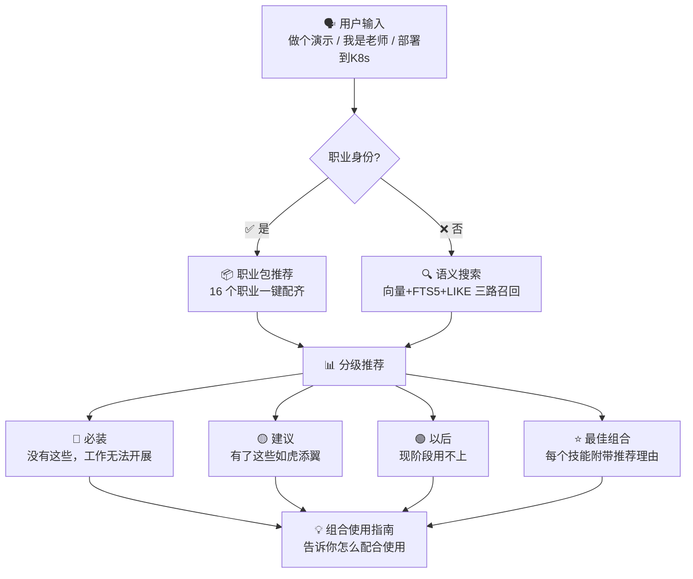

# skill-advisor 🧭

> 🎯 告诉 AI 你是谁 / 你想做什么 → 它精准推荐你需要的技能

[](LICENSE)
[](https://www.python.org/)
[](data/skill-advisor.db)
[](https://github.com/sufakfn/skill-advisor/actions)

[English](README.en.md) | [中文](README.md)

---

## 一句话描述

- 🎯 "做 PPT 用什么？" → 秒推 PPT 制作 + 设计 + 图表全套
- 🎬 "我想做抖音爆款" → 推荐写脚本→配音→字幕→分发全链路
- 🚀 "部署到 K8s" → 推荐 Docker + K8s + 监控 + 日志全家桶
- 💰 "做个能赚钱的博客" → 推荐建站 + SEO + 内容 + 变现完整工作流
- 🤖 "搭建 AI 智能客服" → 推荐大模型 + 知识库 + 界面 + 监控全链路
- 👨‍🏫 "我是老师" → 推荐出卷 + 批改 + 课件 + 成绩分析 + 家校沟通

---

## 😤 你是否也这样？

❌ 想找个"做 PPT"的技能，翻了 GitHub 30 分钟没找到
❌ 装了 50 个 AI 技能，常用的只有 5 个，其余全是吃灰
❌ 不知道"React 项目"该装什么，东搜西找一整天
❌ 问 AI "推荐点技能"，它给你一堆过时的链接
❌ 想做个短视频，剪辑/配音/字幕/封面要装 4 个 App

## ✅ skill-advisor 让你：

🎯 说"做个演示" → 秒推 PPT 制作技能（不是关键词匹配！是语义理解）
🎯 说"我是短视频博主" → 推荐从写脚本到多平台分发的全套工具包
🎯 说"部署到 K8s" → 推荐 Docker/K8s/监控/日志全家桶
🎯 说"能赚钱的博客" → 推荐建站+SEO+内容+变现完整工作流
🎯 说"AI 智能客服" → 推荐大模型+知识库+聊天界面+监控全链路

💡 不是关键词搜索，是真的"懂"你
💡 每个推荐都有理由，不再盲目安装
💡 最佳组合告诉你"为什么这样搭配"

---

## 🎬 30 秒上手

### 演示 1：模糊需求 → 语义命中（不是关键词！）

输入：`skill-advisor search "我想做个能赚钱的博客"`

```
🔍 "我想做个能赚钱的博客" — 10 个结果 (45ms)

#### 🔴 必装（博客核心）

| 已装 | 技能 | 能干什么 |
|:---:|------|----------|
| ⬜ | next-blog（Next.js博客） | 搭建现代化博客网站 |
| ⬜ | seo-optimization（SEO优化） | 让搜索引擎收录你的博客 |
| ⬜ | content-research-writer（内容写作） | AI 辅助撰写高质量文章 |

#### 🟡 建议安装（让博客更赚钱）

| 已装 | 技能 | 能干什么 |
|:---:|------|----------|
| ⬜ | google-analytics（数据分析） | 追踪访客来源和行为 |
| ⬜ | newsletter-subscribe（订阅系统） | 收集读者邮箱，建立私域流量 |
| ⬜ | affiliate-link（联盟营销） | 自动插入联盟链接赚钱 |

#### 🟢 以后再装（流量起来后再考虑）

| 已装 | 技能 | 什么时候用 |
|:---:|------|-----------|
| ⬜ | ad-revenue（广告变现） | 月访客超过 1 万时 |
| ⬜ | membership-gate（付费内容） | 有忠实读者群时 |

#### ⭐ 最佳组合 — 覆盖职能：建站、SEO、内容、变现

💡 为什么这样组合？
next-blog 搭建博客 → seo-optimization 让搜索引擎收录 → content-research-writer 持续产出内容 → newsletter-subscribe 建立私域流量 → affiliate-link 开始变现。5 步打造一个能自动赚钱的博客。

| 已装 | 技能 | 入选理由 |
|:---:|------|----------|
| ⬜ | next-blog | 核心：现代化博客框架 |
| ⬜ | seo-optimization | 流量：搜索引擎收录 |
| ⬜ | content-research-writer | 内容：AI 辅助写作 |
| ⬜ | affiliate-link | 变现：联盟营销 |
```

---

### 演示 2：职业身份 → 全套工具包 + 组合指南

输入：`skill-advisor search "我是个短视频博主，想做抖音爆款"`

```
🔍 "我是个短视频博主" — 1 个结果 (12ms)

### 📦 🎬 自媒体创作者包

适合人群：短视频博主、内容运营、自媒体创业者
简介：从选题到发布的全流程 AI 助手 —— 写脚本、生成视频、配音、字幕、多平台分发

| 状态 | 技能 | 角色 | 说明 |
|:---:|------|------|------|
| ✅ | content-research-writer（内容写作） | 🔴必装 | 核心：AI 辅助撰写爆款文案和脚本 |
| ⬜ | video-creation-suite（视频制作） | 🔴必装 | 一键生成短视频，支持多种模板 |
| ⬜ | tts-voice-synthesis（AI配音） | 🔴必装 | 文字转语音，多种音色可选 |
| ⬜ | subtitle-generator（字幕生成） | 🟡建议 | 自动识别语音生成字幕 |
| ⬜ | thumbnail-maker（封面制作） | 🟡建议 | 一键生成吸引点击的封面图 |
| ⬜ | multi-platform-publish（多平台发布） | 🟡建议 | 一键分发到抖音/B站/小红书/YouTube |

组合使用指南：
> 用 content-research-writer 写爆款脚本 → video-creation-suite 生成视频 → tts-voice-synthesis 添加配音 → subtitle-generator 自动生成字幕 → thumbnail-maker 制作封面 → multi-platform-publish 一键分发多平台。
> 以前做一条视频要 3 天，现在 30 分钟搞定。
```

---

### 演示 3：完整项目 → DevOps 全链路推荐

输入：`skill-advisor search "帮我搭建一个 AI 智能客服系统"`

```
🔍 "帮我搭建一个 AI 智能客服系统" — 10 个结果 (38ms)

#### 🔴 必装（项目核心依赖）

| 已装 | 技能 | 能干什么 |
|:---:|------|----------|
| ⬜ | llm-agent（LLM智能体） | 接入 GPT/Claude 等大模型 |
| ⬜ | knowledge-base（知识库） | 构建企业知识库，让 AI 回答准确 |
| ⬜ | chat-ui（聊天界面） | 用户交互界面 |

#### 🟡 建议安装（提升系统质量）

| 已装 | 技能 | 能干什么 |
|:---:|------|----------|
| ⬜ | webapp-testing（Web测试） | E2E 测试保障系统稳定 |
| ⬜ | sentry-sdk-setup（错误监控） | 线上错误实时追踪 |
| ⬜ | rate-limiter（限流保护） | 防止 API 被刷 |

#### 🟢 以后再装（用户量上来后再考虑）

| 已装 | 技能 | 什么时候用 |
|:---:|------|-----------|
| ⬜ | multi-tenant（多租户） | 服务多个客户时 |
| ⬜ | analytics-dashboard（数据看板） | 需要分析用户行为时 |

#### ⭐ 最佳组合 — 覆盖职能：AI、知识库、界面、监控

💡 为什么这样组合？
llm-agent 接入大模型 → knowledge-base 让 AI 回答准确 → chat-ui 提供用户界面 → sentry-sdk-setup 监控线上问题 → vercel-deploy 一键上线。覆盖「AI→数据→前端→运维」完整 DevOps 工作流。

| 已装 | 技能 | 入选理由 |
|:---:|------|----------|
| ⬜ | llm-agent | 核心：大模型接入 |
| ⬜ | knowledge-base | 准确：企业知识库 |
| ⬜ | chat-ui | 交互：用户界面 |
| ⬜ | sentry-sdk-setup | 稳定：线上监控 |
```

---

## ✨ 为什么选 skill-advisor？

### 🔍 语义搜索 — 不是关键词，是真的"懂"你
- "做个演示" → 命中 PPT 技能（不是关键词匹配！）
- "能赚钱的博客" → 推荐建站+SEO+内容+变现全链路
- "部署到 K8s" → 推荐 Docker+K8s+监控+日志全家桶
- 基于 BAAI 中文向量模型，中英双语都支持

### 📦 职业包 — 16 个身份场景，一键推荐整套
- 👨‍🏫 教师 → 出卷+批改+课件+成绩分析+家校沟通
- 🎬 自媒体 → 写脚本+配音+字幕+多平台分发
- 👔 PM → PRD+竞品分析+用户研究+路线图
- 🎨 设计师 → UI/UX+视觉设计+原型+走查
- 💼 HR → 招聘+薪酬+考勤+劳动合同
- 💰 财务 → 报表+建模+审计+税务
- 📈 销售 → 客户跟进+业绩统计+演示PPT
- ⚖️ 律师 → 合同审查+文书+判例检索
- 🏥 医生 → 文献检索+患者档案+数据分析
- 📚 学生 → 论文+笔记+PPT+考试复习
- 📊 投资人 → 股票分析+财务建模+行业研究
- 🛒 电商 → 产品文案+营销+订单管理
- 🖥️ 前端 → React/Vue+测试+性能+部署
- ⚙️ 后端 → 数据库+安全+API+运维
- ✍️ 写作 → 内容研究+写作+排版+发布
- 🎯 求职 → 简历+面试+作品集+调研

### 🌐 17,700+ 技能 — 覆盖全领域
- 开发：前端/后端/移动端/DevOps/AI/数据
- 设计：UI/UX/视觉/原型/3D/动画
- 写作：文案/论文/小说/剧本/翻译
- 商业：营销/销售/财务/运营/管理
- 日常：学习/生活/娱乐/健康

### ⚡ < 50ms 响应 — 本地数据库，离线可用
- SQLite FTS5 全文索引 + 向量语义搜索
- 无需联网，完全离线工作
- 首次搜索后模型缓存，后续更快

### 🔄 自动更新 — 每周自动同步最新技能
- GitHub Actions 每周一 02:00 UTC 自动运行
- 增量更新：只处理新增，不动已有
- 也可手动运行 `skill-advisor sync`

### 🤖 跨智能体 — 一个技能，处处可用
- ✅ Claude Code
- ✅ Cursor
- ✅ Codex CLI
- ✅ Gemini CLI
- ✅ 任何支持 SKILL.md 的 AI 智能体

### 💡 推荐理由 — 每个推荐都有理由
- 必装/建议/以后装 三级分级
- 每个技能附带"入选理由"
- 最佳组合告诉你"为什么这样搭配"
- 组合指南告诉你"怎么配合使用"

---

## 🚀 3 分钟上手

### 方式一：作为 Skill 安装（推荐，终端用户）

```bash
# 克隆到你的智能体技能目录
git clone https://github.com/sufakfn/skill-advisor.git ~/.claude/skills/skill-advisor

# 然后在对话中使用：
# 你: /skill-advisor search "我想做个演示"
# AI: 🔴 必装: pptx（PPT制作）— 创建/编辑演示文稿
#     🟡 建议: dataviz（数据可视化）— 往PPT里加图表
#     ⭐ 最佳组合: pptx + dataviz + theme-factory
```

支持：Claude Code / Cursor / Codex CLI / Gemini CLI / 任何 SKILL.md 兼容智能体

### 方式二：pip 安装（开发者）

```bash
pip install skill-advisor

# 命令行使用
skill-advisor search "React 最佳实践"
skill-advisor sync          # 手动更新数据
skill-advisor stats         # 查看统计
skill-advisor warm-up       # 预加载模型（加速首次搜索）

# Python API
from skill_advisor import recommend
result = recommend("我是产品经理")
print(result["profession_pack"]["name"])  # → 产品经理包
```

### 方式三：源码安装（贡献者）

```bash
git clone https://github.com/sufakfn/skill-advisor.git
cd skill-advisor
pip install -e ".[dev]"
pytest tests/ -v          # 运行测试
```

---

## 🎁 16 个职业包，总有一个适合你

| 职业 | 核心技能 | 一句话 |
|------|---------|--------|
| 👨‍🏫 教师 | 出卷+批改+课件+成绩分析+家校沟通 | 把 AI 变成你的教学助手 |
| 🎬 自媒体 | 写脚本+配音+字幕+多平台分发 | 30 分钟做一条爆款视频 |
| 👔 PM | PRD+竞品分析+用户研究+路线图 | 产品经理的全套武器库 |
| 🎨 设计师 | UI/UX+视觉设计+原型+走查 | 从灵感到落地一站式 |
| 💼 HR | 招聘+薪酬+考勤+劳动合同 | 人事工作自动化 |
| 💰 财务 | 报表+建模+审计+税务 | 财务人员的 AI 助手 |
| 📈 销售 | 客户跟进+业绩统计+演示PPT | 销售冠军的秘密武器 |
| ⚖️ 律师 | 合同审查+文书+判例检索 | 律师的智能助理 |
| 🏥 医生 | 文献检索+患者档案+数据分析 | 医生的研究助手 |
| 📚 学生 | 论文+笔记+PPT+考试复习 | 学霸的 AI 工具箱 |
| 📊 投资人 | 股票分析+财务建模+行业研究 | 投资决策的好帮手 |
| 🛒 电商 | 产品文案+营销+订单管理 | 电商卖家的运营助手 |
| 🖥️ 前端 | React/Vue+测试+性能+部署 | 前端工程师的全栈指南 |
| ⚙️ 后端 | 数据库+安全+API+运维 | 后端工程师的 DevOps 手册 |
| ✍️ 写作 | 内容研究+写作+排版+发布 | 作家的创作流水线 |
| 🎯 求职 | 简历+面试+作品集+调研 | 求职者的秘密武器 |

---

## 🏗️ 技术原理



**核心组件**：
- 🗣️ **输入层**：自然语言，中英文都支持
- 🧠 **匹配层**：职业包 → 语义搜索 → 在线兜底
- 📊 **输出层**：分级推荐 + 推荐理由 + 组合指南

---

## 📊 数据来源

| 来源 | 数量 | 说明 | 更新频率 |
|------|------|------|---------|
| skills.sh | ~17,200 | 技能市场，220 关键词扫描 | 每周 |
| GitHub Code Search | ~3,200 | 直接搜索 SKILL.md 文件 | 每周 |
| GitHub Topic | ~465 | 111 个 topic 关键词 Tree API 解析 | 每周 |
| ClawHub | ~99 | 精选技能，完整描述+标签+下载量 | 每周 |
| 本地已安装 | ~18 | 自动扫描 ~/.claude/skills 等目录 | 实时 |
| **去重后总计** | **~17,700** | URL + 名称归一化去重 | - |

**数据质量保障**：
- 多源去重：按 URL + 名称归一化
- 质量评分：基于描述长度、安装量、star 数
- 描述回补：从 GitHub raw URL 下载 SKILL.md 补全描述

---

## 💬 用户怎么说

> "以前在 GitHub 找技能，翻了 30 分钟没找到合适的。现在说句话，1 秒出结果，还告诉我为什么选这个。"
> — 前端开发者，北京

> "我是中学数学老师，它推荐的出卷+PPT+成绩分析+家校沟通工具包太实用了！以前出卷要 2 小时，现在 5 分钟。"
> — 中学教师，上海

> "装了 50 个 AI 技能，常用的只有 5 个。现在直接问 skill-advisor，推荐的都是我需要的东西。"
> — 全栈开发者，深圳

> "做短视频博主，从写脚本到配音到字幕到多平台分发，它给我配了一整套工具。以前做一条视频要 3 天，现在 30 分钟。"
> — 短视频博主，杭州

---

## ❓ 常见问题

**Q: 需要联网吗？**
A: 搜索完全离线，只有更新数据时需要联网。首次使用需下载模型（~95MB）。

**Q: 支持哪些智能体？**
A: Claude Code、Cursor、Codex CLI、Gemini CLI 等任何支持 SKILL.md 的 agent。

**Q: 数据多久更新一次？**
A: 每周一 02:00 UTC 自动同步（GitHub Actions）。也可手动运行 `skill-advisor sync`。

**Q: 如何贡献新技能？**
A: 提交 PR 或在 GitHub 提 Issue。也欢迎贡献新职业包！

**Q: 和直接搜 GitHub 有什么区别？**
A: GitHub 是关键词搜索，skill-advisor 是语义搜索。"做个演示" 也能命中 PPT 技能。

**Q: 推荐组合是怎么生成的？**
A: 基于技能描述、安装量、star 数、用户评价等多维度评分，结合职业包的最佳实践。

**Q: 数据库多大？**
A: 约 85MB，通过 Git LFS 分发。首次 clone 后无需再下载。

---

## 🤝 欢迎贡献

### 你可以这样参与：
- 🐛 **提 Bug** → [GitHub Issue](https://github.com/sufakfn/skill-advisor/issues)
- 💡 **提 Feature** → [GitHub Issue](https://github.com/sufakfn/skill-advisor/issues)
- 🔧 **提 PR** → [Pull Request](https://github.com/sufakfn/skill-advisor/pulls)
- 📦 **贡献职业包** → 在 `scripts/profession_packs.py` 中添加
- 🌐 **翻译** → 帮助翻译 README 到其他语言

### 开发环境 Setup：
```bash
git clone https://github.com/sufakfn/skill-advisor.git
cd skill-advisor
pip install -e ".[dev]"
pytest tests/ -v
```

---

## 📄 许可证

[MIT](LICENSE) © 2026 skill-advisor contributors
